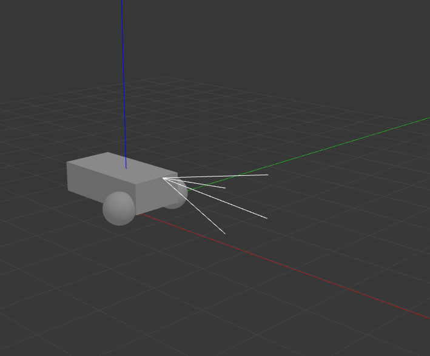
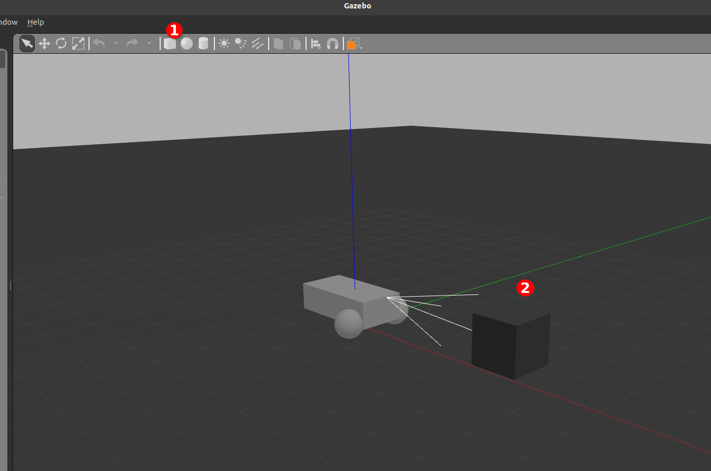
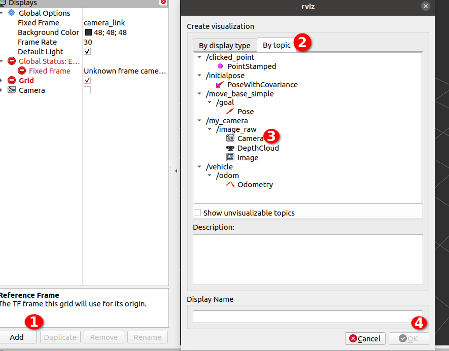

## Keyboard Controlled Simple Gazebo Vehicle 

#### Introduction

This is a Differential Drive Robot in Gazebo.

#### Environment Setup
Installing **ROS Noetic** at *Ubuntu 20.04.3 LTS*
    
    sudo sh -c 'echo "deb http://packages.ros.org/ros/ubuntu $(lsb_release -sc) main" > /etc/apt/sources.list.d/ros-latest.list'
    
    sudo apt install curl # if you haven't already installed curl
     
    curl -s https://raw.githubusercontent.com/ros/rosdistro/master/ros.asc | sudo apt-key add -
     
    sudo apt update
    sudo apt install ros-noetic-desktop-full
     
    source /opt/ros/noetic/setup.bash
    echo "source /opt/ros/noetic/setup.bash" >> ~/.bashrc
    source ~/.bashrc
     
    sudo apt install python3-rosdep python3-rosinstall python3-rosinstall-generator python3-wstool build-essential
    sudo apt install python3-rosdep
     
    sudo rosdep init
    rosdep update
 
Now check

    $ printenv | grep ROS

#### Dependencies
First, if you installed Gazebo from debians, make sure you've installed the Gazebo development files. If you installed Gazebo from source, you can ignore this step. If you have a release other than gazebo11, replace 11 with whatever version number you have.

    $ sudo apt-get install libgazebo11-dev
    

#### Installing and running the project
To install this plugin project, git clone the repo

    $ git clone https://github.com/DSInnovators/ROS-lab.git
    $ cd ROS-lab/ROS1/catkin_ws
    $ catkin_make
    $ source devel/setup.sh 
    $ roscore

In seperate terminal, start gzserver

    $ rosrun gazebo_ros gzserver src/gazebo_vehicle_contorl/worlds/vehicle_control.world --verbose

In separate terminal, start the gui

    $ gzclient

You will see like this.

Insert a box from toolbar.

In seperate terminal, start ROS visualization **rviz**
    
    $ rviz rviz -f camera_link

To view image on camera, add Camera By topic in the following way.

   

In separate terminal, start the keyboard controller

    $ rosrun teleop_twist_keyboard teleop_twist_keyboard.py cmd_vel:=vehicle/cmd_vel

Or you can run the **run_gazebo_vehicle_control.sh** script from **catkin_ws** directory
    
    $ sh src/gazebo_vehicle_contorl/run_gazebo_vehicle_control.sh

#### Output
Click on the play button in the gui to unpause the simulation, and you should see vehicle. You can move control the vehicle with keyboard now and in gazebo desktop you will see your vehicle is moving and in rviz you will see the camera view.
    

   

